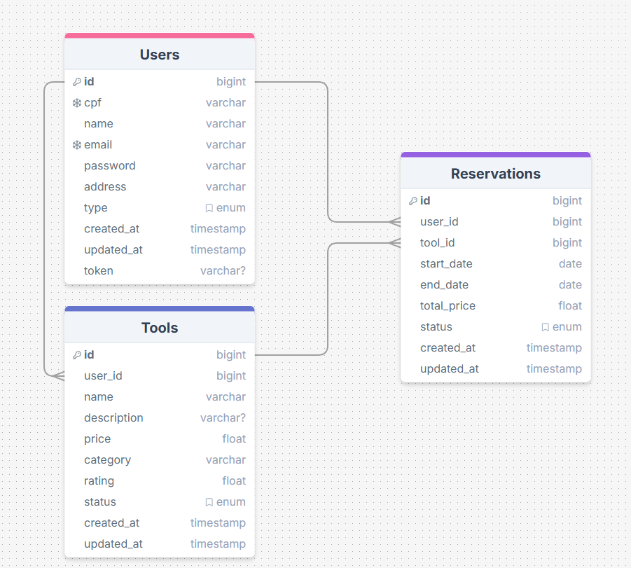

# Plataforma de Aluguel de Ferramentas – "ToolShare" 🛠️

  
 
[](https://nodejs.org)

## Objetivo 🎯

Criar uma plataforma onde pessoas possam alugar ferramentas (como furadeiras, andaimes, etc.) de forma simples e prática, com um sistema de reservas e gestão de itens disponíveis.

### Funcionalidades 🚀

#### Web (ReactJS) 🌐

- Cadastro/login de usuários e criação de perfis de locatários.
- Listagem de ferramentas disponíveis para aluguel com descrições e preços.
- Sistema de reservas e agendamento de horários.
- Histórico de alugueis e avaliações de ferramentas.

#### Mobile (React Native) 📱

- Busca e reserva de ferramentas com geolocalização para encontrar locais próximos.
- Notificações push para confirmações de reserva e devolução de ferramentas.
- Cadastro de novas ferramentas para locação diretamente pelo celular.
- Chat entre locador e locatário para tirar dúvidas sobre as ferramentas.

#### Back-end (Node.js/AdonisJS) 🖥️

- API REST para gerenciar usuários, ferramentas e reservas.
- Autenticação JWT para segurança no acesso.
- Sistema de cálculo de preço de aluguel com base no tempo e tipo de ferramenta.

## 🛠️ Tecnologias e Ferramentas Utilizadas

<p align="center">
    
    
    
    
</p>

## Instalação

Antes de criar uma nova aplicação, você deve garantir que tem o Node.js e o npm instalados no seu computador. **AdonisJS precisa da versão 22 ou superior do Node.js**.

Você pode instalar o Node.js usando os [instaladores oficiais](https://nodejs.org/en/download/), o [Volta](https://docs.volta.sh/guide/getting-started) ou o [nvm](https://github.com/nvm-sh/nvm). Volta e nvm são gerenciadores de pacotes multiplataforma que permitem instalar e executar várias versões do Node.js no seu computador.

Verifique a versão do Node.js:

```bash
node -v
```

Para instalar o AdonisJS, execute o seguinte comando:

```bash
npm init adonisjs@latest hello-world
```

## 🐳 Criar um Banco de Dados no Docker

Inicialize o Docker e inicie o container:

```bash
docker start [CONTAINER_NAME] ou [CONTAINER_ID]
```

Depois, use `docker exec` para rodar o SQL no PostgreSQL:

```bash
docker exec -it postgres sql -U postgres
```

Então, crie uma database:

```sql
create database toolshare;
```

Para sair, use:

```sql
\q
```

Depois, coloque as informações no arquivo `.env`.

Agora, replicar o modelo do banco de dados para a migration:



Agora, é necessário criar uma migration para tools, usando o comando:

```bash
node ace make:model Tool -c -m
```

Poderia ter sido criado o model, o controller e a migration separadamente, mas com esse comando é criado tudo de uma vez só.

Depois, faça as alterações nos models `User.ts` e `Tool.ts`, e faça o relacionamento entre as tabelas:

```typescript
@hasMany(() => Tool)
public tools: HasMany<typeof Tool>
```

Depois, podemos rodar as migrations usando o código:

```bash
node ace migration:run
```

## 🔍 Acessando o PostgreSQL

Execute novamente o comando para entrar no PostgreSQL:

```bash
docker exec -it postgres sql -U postgres
```

Use o comando para abrir a database:

```sql
\c [NOME_DO_BANCO]
```

Após entrar no banco, execute:

```sql
\dt
```

Para mostrar quais tabelas estão no database.

Caso queira ver somente uma tabela, execute o comando:

```sql
\d [NOME_DA_TABELA]
```

## 📚 Referência

Para mais detalhes e guias sobre o AdonisJS, consulte a documentação oficial: [AdonisJS Documentation](https://docs.adonisjs.com/guides/preface/introduction).

## Status 🚧

### Este repositório está em construção.
